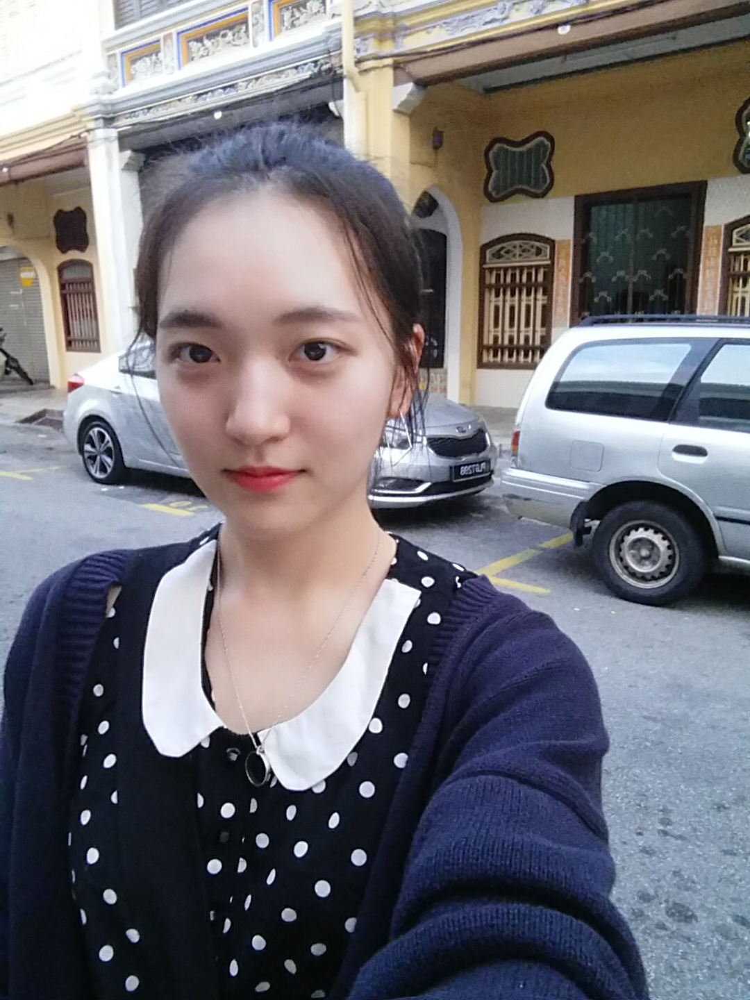
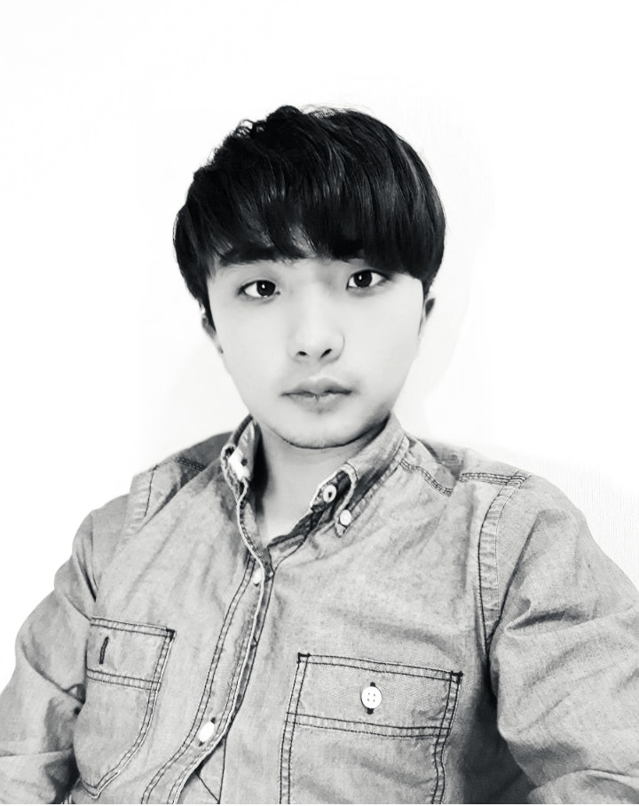

# 인공지능을 적용한 실시간 적외선 이미지 객체 탐지 서비스

팀페이지 주소: https://kookmin-sw.github.io/capstone-2020-14/

## 1. 프로젝트 소개

### 1.1. 프로젝트 개요

최근 대두되고 있는 인공지능 기술 중 하나인 신경망을 이용한 객체 탐지(object detection)를 적외선 카메라에 적용을 하여 객체를 탐지할 것이다.그러면 다음과 같이 가시광선만을 이용한 카메라로는 탐지가 어려운 상황에서도 훌륭한 성능을 보이는 것이 가능하다.

 

### 1.2. 추진 배경 및 필요성

일반 가시광선 이미지와 달리 적외선 이미지의 경우 객체 탐지가 힘들다는 애로사항이 존재한다. 이를 심층학습(deep learning)을 통해 학습한 객체 탐지 기술을 자율주행, 안심귀가, 군 부대 등의 영역에 적용할 수 있다면 유용한 기술이 될 수 있을 것이다. 

### 1.2.1. 기술 발전 현황

일반 가시광선 카메라를 이용한 객체 탐지 기술은 [그림 3]에서 나타나듯 많이 발전해왔다. 객체 탐지 기술은 [그림 4]와 같이 특정 사진이 주어지면 그 사진안의 객체들을 탐지하는 기술이다.

<center></center>

<center>그림 1. 객체 탐지 모델 계보</center>

<center></center>

<center>그림 2. 객체 탐지 예시</center>

### 1.2.2. 기존 기술의 문제점 및 해결 방안

기존의 여러 신경망 모델들의 경우, 가시광선 이미지를 기반으로 심층학습을 진행하였다. 그렇기 때문에, 가시광선 이미지 기반의 신경망은 적외선 이미지에서 제대로 동작하지 못하였다. 이러한 해결책으로는 아래와 같다.

- 적외선 이미지 데이터 집합 기반의 심층학습 진행

위의 언급한 해결 방안을 바탕으로 Faster R-CNN 신경망을 학습한 결과는 아래와 같으며 여러 개의 사진을 예측한 후 gif 형식으로 묶었다.


<center>그림 3. FLIR 적외선 이미지 데이터 집합 학습 후 예측 결과</center>


<center>그림 4. 테스트용 적외선 카메라를 이용한 예측 결과</center>

하지만 Faster R-CNN 신경망의 경우 two-stage detector 라는 점으로 인하여 실시간 객체 탐지가 불가능하다는 단점이 존재한다. 그렇기 때문에 YOLO 신경망을 이용하여 실시간 적외선 이미지 객체 탐지를 진행할 것이다.


## 2. 팀 소개

<center></center>

```
이재구 교수님
```


<center></center>

```
이름: 박은환
역할: YOLO 신경망 관련 연구 및 백엔드 개발
이메일: judepark@kookmin.ac.kr
```


<center></center>

```
이름: 이로제
역할: 적외선 카메라와 tx 2 보드 연결 및 입력 데이터 관리
이메일: bluevin@kookmin.ac.kr
```

<center></center>

```
이름: 이재빈
역할: 웹 서버와 tx board 연결하는 네트워크 구축
이메일: jaebinlee96@kookmin.ac.kr
```

<center></center>

```
이름: 이명학
역할: YOLO 신경망 및 관련 연구
이메일: mh9716@kookmin.ac.kr
```

<center></center>

```
이름: 정진우
역할: 웹 서버와 tx board 연결하는 네트워크 구축
이메일: jtc5311@kookmin.ac.kr
```

<center></center>

```
이름: 주가
역할: 웹 서버와 tx board 연결하는 네트워크 구축
이메일: jtc5311@kookmin.ac.kr
```


## 3. Abstract

Unlike ordinary visible light images, there are difficulties in object detection in the case of infrared images. This can be a useful technique if object detection technology learned through deep learning can be applied to areas such as autonomous driving, safe return, and military units.

The key contributions of this project follows as:

- Object detection technology using an infrared camera.
- Building the real product for actual positive effect.
- All the code of this project will be released when due date.

## 4. 소개 영상


<iframe width="560" height="315" src="https://www.youtube.com/embed/06iZmmjt9rY" frameborder="0" allow="accelerometer; autoplay; encrypted-media; gyroscope; picture-in-picture" allowfullscreen></iframe>

## 5. 결과 영상


## 6. 참고 문헌

