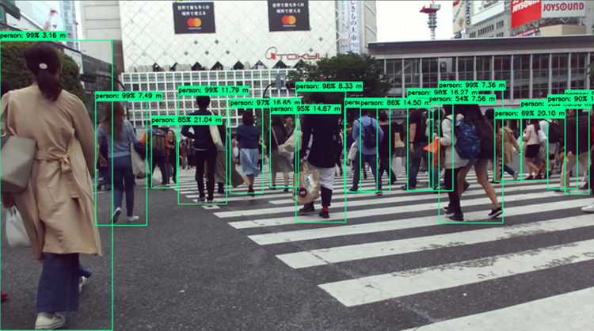
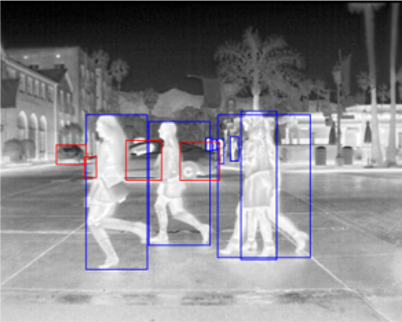

## 언제 어디서든 안심귀가

팀페이지 주소: https://kookmin-sw.github.io/capstone-2020-14/

## 1. 프로젝트 소개

### 1.1. 프로젝트 개요

최근 대두되고 있는 인공지능 기술 중 하나인 신경망을 이용한 객체 탐지(object detection)를 적외선 카메라에 적용을 하여 객체를 탐지할 것이다. 그리고 이 기술을 기존의 안심귀가 서비스에 적용하여 강화된 안심귀가 서비스를 구축할 것이다.

### 1.2. 추진 배경 및 필요성

현재에도 계속해서 범죄와 관련한 여러 기사들을 찾아볼 수 있다. [그림 1]을 통해서는 한국의 많은 사람들이 범죄에 대한 불안감을 지니고 있음을 알 수 있다. 또한, 한국보건사회연구원의 우선희 전문연구원이 분석한 '범죄피해 불안과 인구 사회학적 요인:유럽국과의 비교를 중심으로' 보고서를 보면, 한국 여성(만19∼75세)들은 유럽 여성들보다 혼자 밤길 걷는 데 불안함을 느끼는 경우가 더 많았고 한다.[1] 이와 같은 전문가의 분석과 설문조사 결과를 통해서 사람들이 범죄에 많은 불안감을 지니고 있으며, 시간대별 범죄의 실제적 비율을 나타내는 [그림 2]를 통해 특히 늦은 시간대의 어두운 밤길과 같은 경우에는 많은 사람들이 실제로 범죄에 노출되어 있다는 것을 알 수 있다.

사람들의 불안 심리를 안정시키고 범죄들을 예방하기 위하여 심층학습(deep learning)을 통해 학습한 객체 탐지 기술을 안전귀가 서비스에 적용할 것이다. 위의 문제에서 나타나듯 사람들이 불안해하는 어두운 환경에서도 객체 탐지가 가능하기위해서 일반 가시광선 카메라가 아닌 적외선 카메라를 이용한 객체 탐지 기술을 개발해볼 것이다.

<center></center>

<center>그림 1. 국가와 성별에 따른 불안 비율</center>

</br>


<center></center>

<center>그림 2. 시간대별 범죄 발생 비율</center>

</br>

### 1.2.1. 기술 발전 현황

일반 가시광선 카메라를 이용한 객체 탐지 기술은 [그림 3]에서 나타나듯 많이 발전해왔다. 객체 탐지 기술은 [그림 4]와 같이 특정 사진이 주어지면 그 사진안의 객체들을 탐지하는 기술이다.

<center></center>

<center>그림 3. 객체 탐지 모델 계보</center>

</br>

<center></center>

<center>그림 4. 객체 탐지 예시</center>

</br>

### 1.2.2. 기존 기술의 문제점 및 해결 방안

기존에도 방범을 목적으로 한 안전귀가를 위한 CCTV는 곳곳에 존재한다. 하지만 대부분의 CCTV는 단순히 영상을 촬영하는 것으로 몇가지 문제점이 발생한다. 한계점은 다음과 같다.

1. 가시광선을 이용한 카메라에서는 빛의 유무, 그리고 기상 상황에 따라 탐지 성능이 크게 좌우될 수 있다.

2. 감시를 위해서는 CCTV를 오랜 시간 살펴야 하므로 인적 자원이 들어가며 효율이 떨어진다

3. 기존의 CCTV들은 24 시간 동안 모든 영상을 저장하므로 저장공간의 부족 문제로 인하여 일정 시간이 지나면 데이터를 지워야 하는 상황이 발생한다

첫 번째 문제점을 해결하기 위하여 가시 광선을 이용한 카메라를 사용하지 않고 적외선을 이용한 카메라를 이용할 것이며 두 번째 문제를 해결하기 위해서는 자동으로 객체를 탐지해주는 객체 탐지 모델을 적용할 것이다. 적외선 카메라는 빛의 유무가 객체의 탐지 성능에 영향을 주지 않고 또한 악천후에도 가시광선 카메라에 비하여 성능이 좋다. 적외선 카메라를 이용한 객체 탐지의 예시를 들면 다음과 같다.

<center></center>

<center>그림 5. 적외선 이미지 객체 탐지</center>

</br>

하지만 적외선 카메라는 범죄가 발생했을 때 그 범죄자의 얼굴을 제대로 잡지 못하는 문제가 있다. 따라서 평소에는 적외선 카메라를 통하여 촬영을 하고 객체 탐지 결과 수상한 행동을 하는 경우(오랜 시간 동안 한 자리에서 움직이지 않는 등의)만 일반 가시광선을 이용하여 촬영을 하는데 이 때 플래시 등을 이용하여 촬영을 하도록 한다면 어느 정도의 신원 파악은 가능할 것이다. 또한 이렇게 이벤트가 발생한 부분만 저장을 한다면 위에서 문제점으로 제시하였던 CCTV의 용량관련 문제도 해결할 수 있을 것으로 예측된다.

## 2. 팀 소개

<center></center>

```
이재구 교수님
```


<center></center>

```
이름: 박은환
역할: YOLO 신경망 및 관련 연구
이메일: judepark@kookmin.ac.kr
```


<center></center>

```
이름: 이로제
역할: 적외선 카메라와 tx 2 보드 연결 및 입력 데이터 관리
이메일: bluevin@kookmin.ac.kr
```

<center></center>

```
이름: 이재빈
역할: 웹 서버와 tx board 연결하는 네트워크 구축
이메일: jaebinlee96@kookmin.ac.kr
```

<center></center>

```
이름: 이명학
역할: YOLO 신경망 및 관련 연구
이메일: mh9716@kookmin.ac.kr
```

<center></center>

```
이름: 정진우
역할: 웹 서버와 tx board 연결하는 네트워크 구축
이메일: jtc5311@kookmin.ac.kr
```

<center></center>

```
이름: 주가
역할: 웹 서버와 tx board 연결하는 네트워크 구축
이메일: jtc5311@kookmin.ac.kr
```


## 3. Abstract


## 4 . 사용법

## 5. 결과 영상


## 6. 참고 문헌

[1]. https://www.yna.co.kr/view/AKR20180830133300797